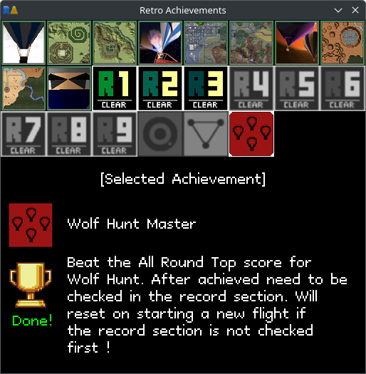

# GRA - Go Retro Achievements
A small viewer meant to showcase the current progress of your achievement hunting,
as well as to easily navigate which ones remain.

## Screenshot

## Build
Check out the repo and to the following
```bash
go get
go build
```
The binary `gra` should be available in the same folder.

## Run
1. Either grab a binary from the releases page, or check out the repo and build the source.
2. Copy config.toml.example to config.toml, fill in the needed information (username and api key)
3. Run the program with `./gra`

## Config

| Config             | Category | Type   | Required | Comment                                                                                        |
|--------------------|----------|--------|----------|------------------------------------------------------------------------------------------------|
| username           | connect  | string | yes      | RA username of user whom the application should track.                                         |
| apiKey             | connect  | string | yes      | RA Api key, used to authenticate the user, get one from https://retroachievements.org/settings |
| refreshInterval    | connect  | int    | no       | How often in seconds the application should poll for new information from RA. **Default: 5**   |
| achievementsPerRow | display  | int    | no       | How many achievements to display per row. **Default: 8**                                       |
| disableAutoMode    | display  | bool   | no       | Disable Auto Mode. **Default: false**                                                          |
| hideMode           | display  | bool   | no       | Disable Mode display in lower right corner. **Default: false**                                 | 
